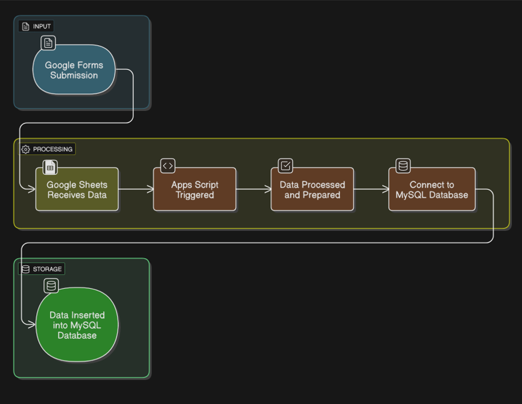

# Google Forms to MySQL Integration

This project demonstrates how to automatically connect **Google Forms responses** to a **MySQL database**.  
It uses Google Apps Script and MySQL to capture data seamlessly without manual exports.

---

## 🚀 Features
- Real-time saving of Google Form responses  
- Uses **Apps Script** for automation  
- Stores data directly into **MySQL**  
- Can be customized for surveys, attendance, or feedback forms  

---

## 📊 Project Workflow

The following diagram explains how Google Forms responses are processed and stored in MySQL:

---

## 🛠️ Tech Used
- **Google Apps Script (.gs)**  
- **MySQL Database**  
- **Excel Template (.xlsx)**  

---

## ⚙️ Setup Guide
1. Copy the provided Apps Script files (`Code.gs`, `Converter.gs`, `Helper.gs`) into your Google Apps Script editor.  
2. Connect your Google Form → Google Sheet.  
3. Configure your database credentials.  
4. Deploy the script to run automatically on new form submissions.  

---

## 📊 Example Use Case
- Collect student attendance via Google Forms  
- Store responses directly in a database  
- Generate reports easily using SQL queries

---

## ✨ Author
Author: Vishal Rajak  
📌 Internship Project Submission
